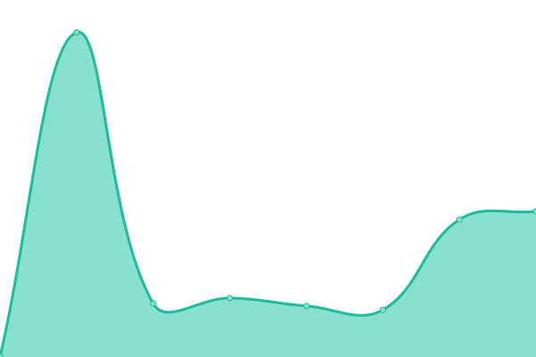
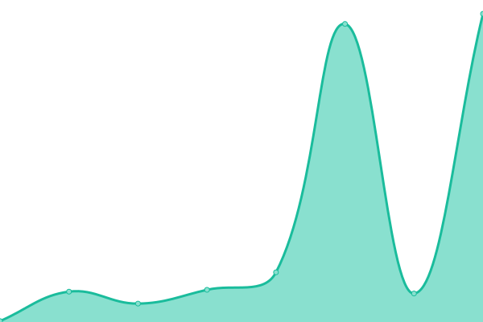
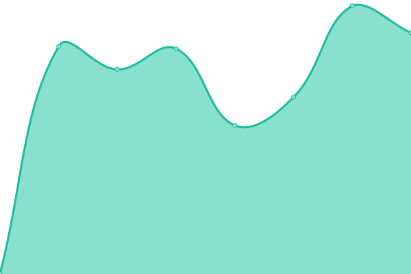
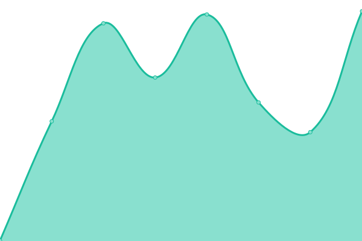
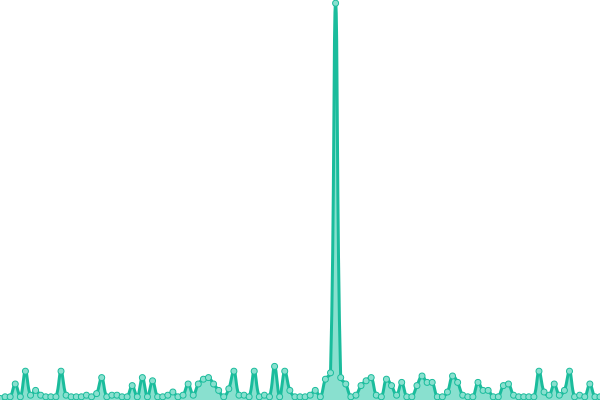

# [📈 Live Status](https://status.ku.ni): <!--live status--> **🟩 All systems operational**

This repository contains the open-source uptime monitor and status page for [KUNI Global](https://ku.ni), powered by [Upptime](https://github.com/upptime/upptime).

With [Upptime](https://upptime.js.org), you can get your own unlimited and free uptime monitor and status page, powered entirely by a GitHub repository. We use [Issues](https://github.com/KUNI-Global/radar/issues) as incident reports, [Actions](https://github.com/KUNI-Global/radar/actions) as uptime monitors, and [Pages](https://status.ku.ni) for the status page.

<!--start: status pages-->
<!-- This summary is generated by Upptime (https://github.com/upptime/upptime) -->
<!-- Do not edit this manually, your changes will be overwritten -->
<!-- prettier-ignore -->
| URL | Status | History | Response Time | Uptime |
| --- | ------ | ------- | ------------- | ------ |
|  [KUNI — main HTTPS](https://ku.ni) | 🟩 Up | [kuni-main-https.yml](https://github.com/KUNI-Global/radar/commits/HEAD/history/kuni-main-https.yml) | 

 403ms
     
 | 

<a href="https://status.ku.ni/history/kuni-main-https">100.00%</a>
    

|  [KUNI — main HTTP](http://ku.ni) | 🟩 Up | [kuni-main-http.yml](https://github.com/KUNI-Global/radar/commits/HEAD/history/kuni-main-http.yml) | 

 104ms
     
 | 

<a href="https://status.ku.ni/history/kuni-main-http">100.00%</a>
    

|  [KUNI — FastDL HTTPS](https://fastdl.ku.ni) | 🟩 Up | [kuni-fast-dl-https.yml](https://github.com/KUNI-Global/radar/commits/HEAD/history/kuni-fast-dl-https.yml) | 

 644ms
     
 | 

<a href="https://status.ku.ni/history/kuni-fast-dl-https">100.00%</a>
    

|  [KUNI — FastDL HTTP](http://fastdl.ku.ni) | 🟩 Up | [kuni-fast-dl-http.yml](https://github.com/KUNI-Global/radar/commits/HEAD/history/kuni-fast-dl-http.yml) | 

 480ms
     
 | 

<a href="https://status.ku.ni/history/kuni-fast-dl-http">100.00%</a>
    

|  [KUNI — Cloudflare Check IPv4](ku.ni) | 🟩 Up | [kuni-cloudflare-check-i-pv4.yml](https://github.com/KUNI-Global/radar/commits/HEAD/history/kuni-cloudflare-check-i-pv4.yml) | 

 7ms
     
 | 

<a href="https://status.ku.ni/history/kuni-cloudflare-check-i-pv4">56.20%</a>
    

|  [KUNI — Cloudflare Check IPv4](ku.ni) | 🟩 Up | [kuni-cloudflare-check-i-pv4.yml](https://github.com/KUNI-Global/radar/commits/HEAD/history/kuni-cloudflare-check-i-pv4.yml) | 

 7ms
     
 | 

<a href="https://status.ku.ni/history/kuni-cloudflare-check-i-pv4">56.20%</a>
    

<!--end: status pages-->

[**Visit our status website →**](https://status.ku.ni)

## 📄 License

- Powered by: [Upptime](https://github.com/upptime/upptime)
- Code: [MIT](./LICENSE) © [Anand Chowdhary](https://anandchowdhary.com), supported by [Pabio](https://pabio.com)
- Data in the `./history` directory: [Open Database License](https://opendatacommons.org/licenses/odbl/1-0/)
